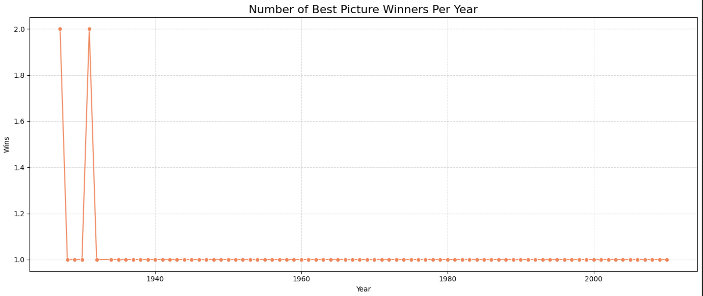
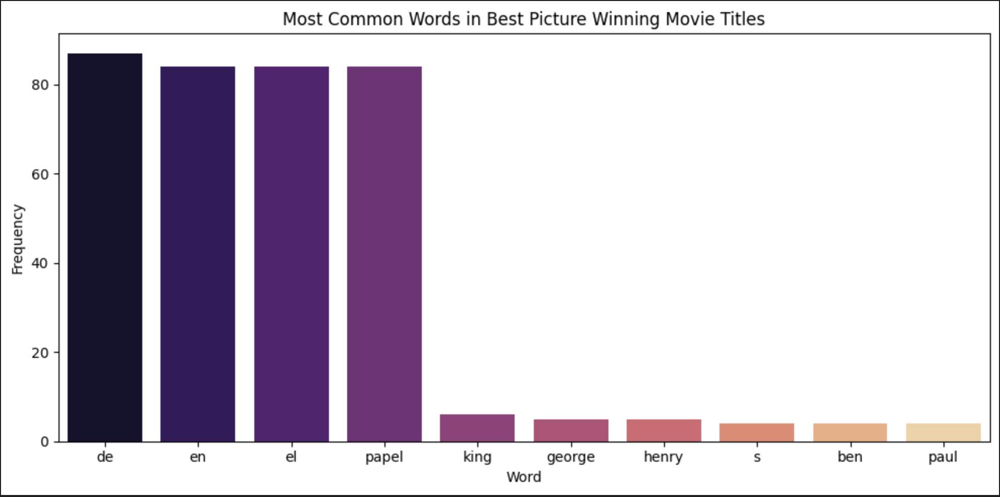
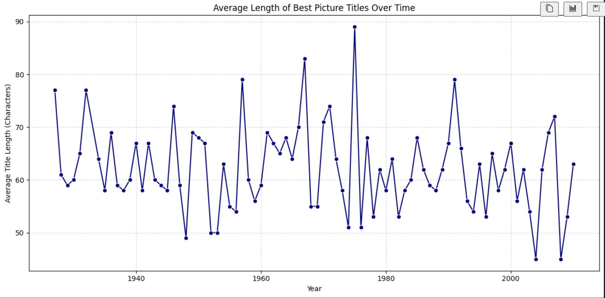
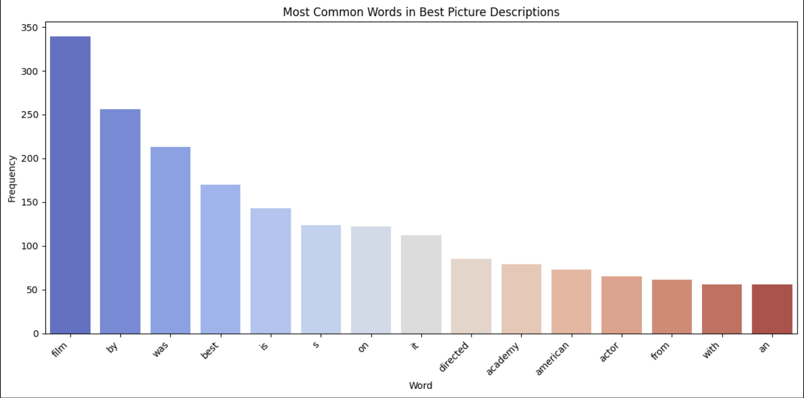

# 🎬 Oscar Winner Predictor Project

This project explores historical patterns in Oscar Best Picture winners and implements data mining techniques to visualize trends and perform preliminary analyses. It integrates live web scraping, visual storytelling, and diversity analytics — laying the groundwork for future predictive modeling of Oscar winners.

## 📌 Project Overview

The goal of this project is to:
- Analyze trends in Best Picture winners from 1927 to 2024
- Clean and combine historical and live data from Wikipedia and GitHub
- Visualize data trends using matplotlib and seaborn
- Explore racial representation among Best Picture directors
- Lay the foundation for future machine learning-based Oscar prediction

## 📁 Data Sources

- [Oscar Winners GitHub Dataset](https://raw.githubusercontent.com/fontanon/oscarwinners/master/oscar-winners.csv)
- [Academy Award for Best Picture - Wikipedia](https://en.wikipedia.org/wiki/Academy_Award_for_Best_Picture)

## 📊 Visualizations

- **Yearly Distribution of Best Picture Winners**
- **Most Common Words in Title Names**
- **Average Title Length Over Time**
- **Most Common Words in Description Fields**

## 🧹 Tools and Libraries

- `pandas`
- `matplotlib`
- `seaborn`
- `BeautifulSoup` for web scraping
- `re` and `collections.Counter` for text mining

## 🖼️ Screenshots

### 1. 📈 Best Picture Wins Per Year

### 2. 🔤 Most Common Words in Titles

### 3. 📐 Title Length Over Time

### 4. 📝 Common Words in Descriptions

## ✅ Summary

This notebook demonstrates:
- Real-world data cleaning and merging
- Applied data visualization for storytelling
- Exploratory work for predictive modeling in entertainment analytics

## 🚀 Future Work

- Add critic and audience scores (IMDb, Rotten Tomatoes)
- Train a logistic regression or random forest model to predict winners
- Analyze more award categories and apply clustering for thematic insights

---
